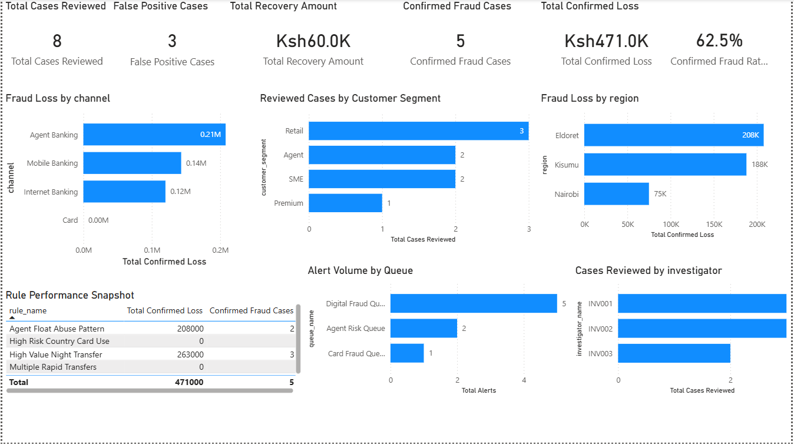
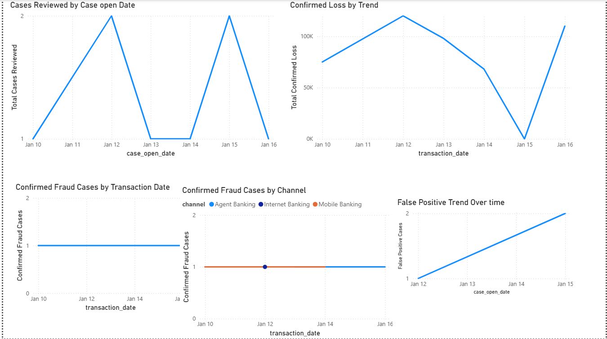
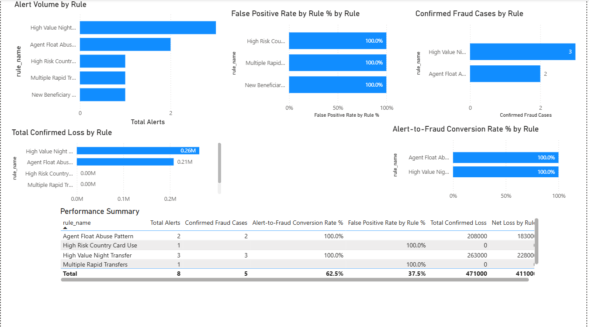
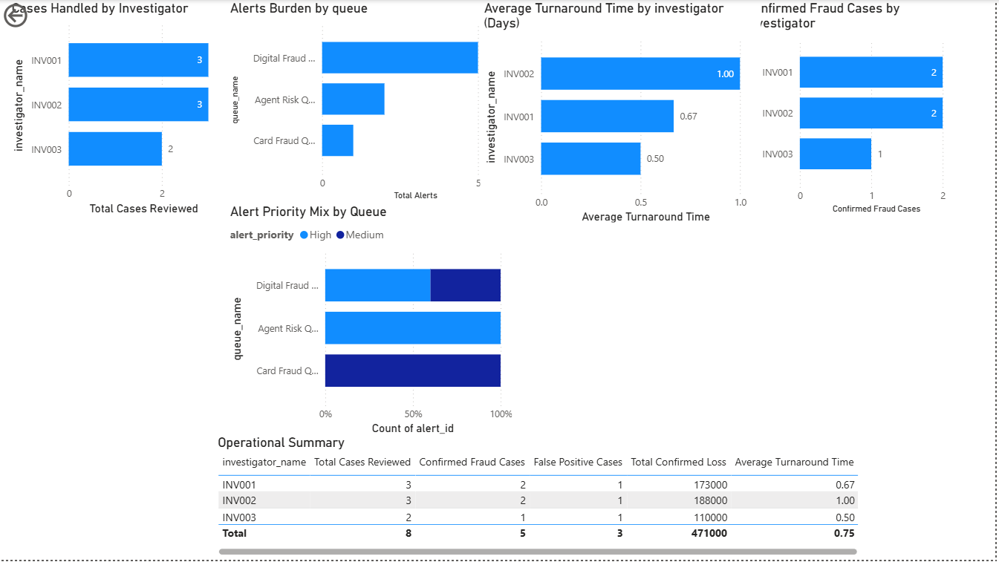

# Bank Fraud Monitoring & Rule Performance Lab

## Project Overview
This project simulates how a bank fraud analytics team could use data to monitor fraud exposure, evaluate rule effectiveness, track investigator workload, and support management decision-making.

I built a multi-page Power BI dashboard using a relational fraud dataset covering transactions, alerts, rules, cases, and customers. The goal was to show that fraud analytics is not only about detecting suspicious activity, but about turning fraud data into decision support for leadership, operations, and control improvement.

## Business Problem
Banks and digital financial institutions face growing fraud pressure across multiple channels, while fraud operations teams are often overloaded with alerts and case reviews.

Leadership needs clear answers to questions like:
- Where is fraud happening?
- Which channels are driving the highest loss?
- Which customer groups and regions are carrying the most fraud exposure?
- Which rules are useful and which are noisy?
- How much confirmed fraud are we catching?
- How much recovery is reducing the final impact?
- Where is alert burden creating operational strain?

This project was designed to answer those questions through practical fraud monitoring and reporting.

## Project Objectives
The project was built to demonstrate:
- Fraud KPI / KRI thinking
- Rule performance analysis
- Fraud trend monitoring
- Alert burden and workload analysis
- Executive dashboard design
- Power BI measure creation
- Relationship-based reporting across linked fraud tables
- Decision-support thinking in a fraud environment

## Dataset Structure
The dashboard uses a linked fraud dataset with the following core tables:

- **transactions_cleaned**  
  Stores transaction-level activity such as channel, transaction date, amount, transaction type, country, device, and status.

- **alerts_cleaned**  
  Stores fraud alerts generated by rules, including rule ID, queue, alert date, priority, and assigned investigator.

- **rules_cleaned**  
  Stores fraud detection rule metadata such as rule name, rule category, threshold logic, and active status.

- **cases_cleaned**  
  Stores reviewed fraud case outcomes, including disposition, confirmed fraud flag, confirmed loss amount, recovery amount, and case dates.

- **customers_cleaned**  
  Stores customer segmentation and regional attributes such as customer segment, customer type, risk rating, and region.

## Dashboard Pages

### 1. Executive Overview
This page gives leadership a one-glance summary of fraud exposure, fraud outcomes, and operational pressure.

Key content:
- Total Cases Reviewed
- Confirmed Fraud Cases
- False Positive Cases
- Total Confirmed Loss
- Total Recovery Amount
- Net Loss
- Confirmed Fraud Rate %
- Fraud Loss by Channel
- Reviewed Cases by Customer Segment
- Fraud Loss by Region
- Rule Performance Snapshot
- Operational Snapshot

### 2. Fraud Trends
This page shows how fraud activity, reviewed case volume, loss, and false positive noise change over time.

Key content:
- Cases Reviewed by Case Open Date
- Confirmed Fraud Cases by Transaction Date
- Confirmed Fraud Trend by Channel
- Daily Confirmed Loss Trend
- False Positive Trend Over Time

### 3. Rule Performance
This page shows how well detection rules are performing from both a fraud capture and noise perspective.

Key content:
- Alert Volume by Rule
- Confirmed Fraud Cases by Rule
- Alert-to-Fraud Conversion Rate by Rule
- False Positive Rate by Rule
- Confirmed Fraud Loss by Rule
- Rule Performance Summary Table

### 4. Workload and Operations
This page shows operational burden on investigators and fraud queues.

Key content:
- Cases Handled by Investigator
- Confirmed Fraud Cases by Investigator
- Alert Burden by Queue
- Alert Priority Mix by Queue
- Average Turnaround Time by Investigator
- Operational Summary Table

### 5. Customer / Segment Risk View
This page shows how fraud risk is distributed across customer segments and regions.

Key content:
- Reviewed Cases by Customer Segment
- Confirmed Fraud Cases by Customer Segment
- Confirmed Fraud Loss by Customer Segment
- Reviewed Cases by Region
- Confirmed Fraud Loss by Region
- Segment Summary Table

  ## Dashboard Preview

### Executive Overview

### Fraud Trends

### Rule Performance

### Workload and Operations

### Customer / Segment Risk View

## Key Measures Built
Some of the core measures used in the dashboard include:
- Total Cases Reviewed
- Confirmed Fraud Cases
- False Positive Cases
- Total Confirmed Loss
- Total Recovery Amount
- Net Loss
- Confirmed Fraud Rate %
- Total Alerts
- Alert-to-Fraud Conversion Rate %
- False Positive Rate by Rule %
- Average Turnaround Time

## Key Fraud Analytics Themes Demonstrated
This project was designed to show that fraud reporting should cover more than just fraud counts. It also included:

- **Financial impact**  
  Gross loss, recovery, and net loss

- **Detection quality**  
  Rule conversion rate and false positive rate

- **Operational burden**  
  Queue volume, investigator workload, and turnaround time

- **Concentration of risk**  
  Fraud by channel, segment, and region

- **Trend monitoring**  
  Reviewed cases, confirmed fraud, loss, and noise over time

## Example Insights This Dashboard Can Surface
Examples of questions this dashboard helps answer:
- Which fraud rules are creating meaningful detections versus unnecessary noise?
- Which channels are driving confirmed fraud loss?
- Which queues are carrying the highest alert burden?
- Which customer segments are generating review activity but not necessarily high fraud loss?
- Which regions show lower case counts but higher loss severity?
- Whether the fraud operation is absorbing the workload efficiently

## Tools Used
- **Power BI** – dashboard design, measures, visuals, and reporting
- **SQL** – fraud KPI logic, rule analysis logic, trend logic, and workload analysis
- **Excel / CSV** – data preparation and validation
- **Fraud analytics thinking** – KPI design, control-performance reasoning, and executive reporting structure

## Why This Project Matters
This project demonstrates that fraud analytics is not just about detection models or suspicious transactions. It is also about:
- translating fraud data into management information
- showing where controls are working or failing
- making operational burden visible
- helping leadership prioritize action

## Portfolio Value
This project is relevant for roles such as:
- Fraud Analyst
- Fraud Analytics Analyst
- Fraud Reporting Analyst
- Fraud Intelligence Analyst
- Fraud Strategy Analyst
- Fraud Operations Analyst

It demonstrates practical skills in fraud reporting, dashboarding, rule-performance analysis, and decision-support communication.

## Next Enhancements
Possible future improvements:
- Add drill-through views for channels, rules, and investigators
- Add monthly trend views using a calendar table
- Add severity scoring and risk-tier logic
- Add executive narrative commentary
- Build a companion Excel or SQL insight pack
